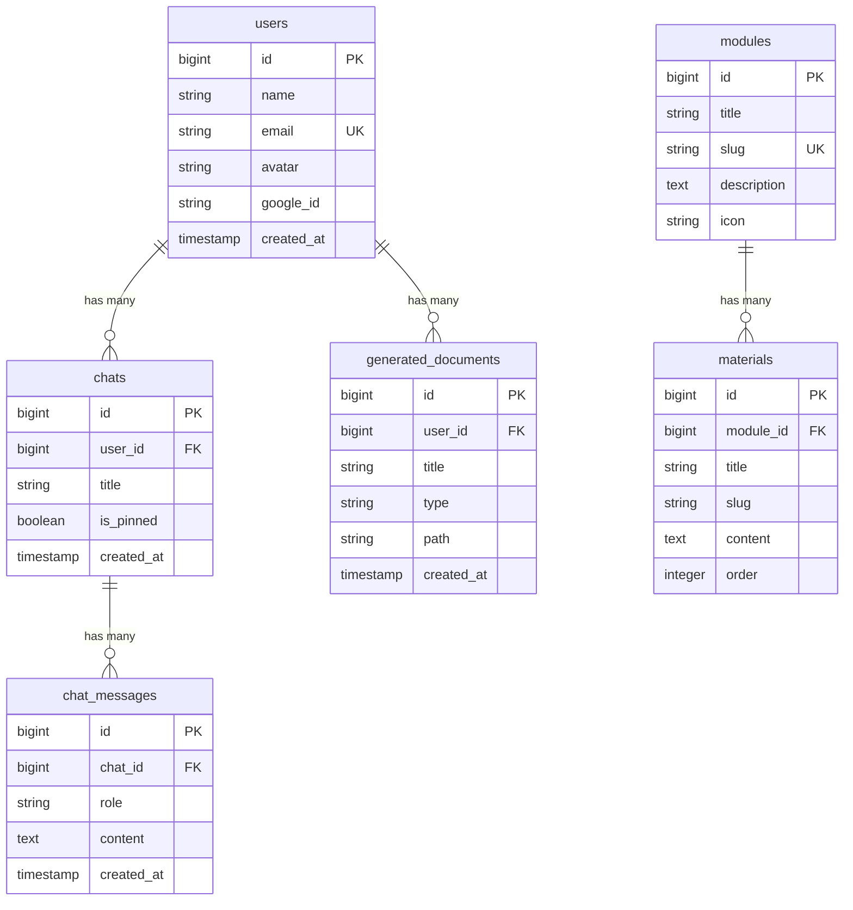
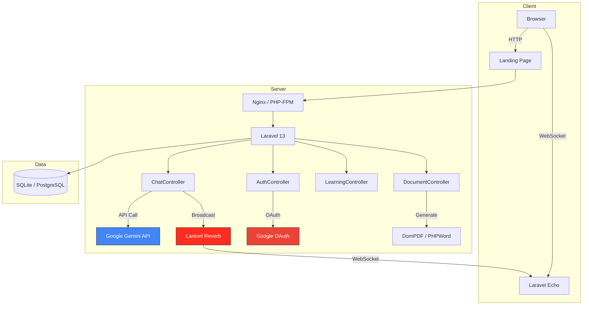

<p align="center">
  
</p>

<h1 align="center">🎓 EduPath</h1>

<p align="center">
  <strong>AI-Powered Personalized Learning Platform</strong><br>
  Empowering students with intelligent educational assistance, interactive learning modules, and real-time AI conversations.
</p>

<p align="center">
  
  
  
  
  
  
</p>

---

## 📋 Overview

**EduPath** is a modern, AI-powered educational platform built with Laravel 13 that provides personalized learning experiences through intelligent conversations. It leverages Google's Gemini API to deliver contextual, accurate responses to student queries while offering structured learning modules across multiple topics.

Whether you're a student looking for study assistance or an educator seeking innovative teaching tools, EduPath bridges the gap between traditional learning and AI-enhanced education.

---

## ✨ Features

| Feature | Description |
|---------|-------------|
| 🤖 **AI Chat Assistant** | Intelligent conversations powered by Google Gemini API with streaming responses and typing effects |
| 📚 **Learning Modules** | 10 structured topics with 100 curated learning materials |
| 💬 **Real-Time Messaging** | WebSocket-powered live communication using Laravel Reverb |
| 🔐 **Google OAuth** | Seamless authentication via Google Sign-In with Laravel Socialite |
| 📊 **Dashboard** | Personalized dashboard with chat statistics and activity overview |
| 📄 **Document Export** | Export conversations and materials to PDF (DomPDF) or DOCX (PHPWord) |
| 📁 **Document History** | Browse and manage previously exported documents |
| 📌 **Chat Management** | Pin, rename, and organize chat conversations |
| 🎨 **Responsive UI** | Beautiful, mobile-first interface built with Tailwind CSS 4 |
| 🐳 **Docker Ready** | Production-ready containerized deployment with Nginx + PHP-FPM |

---

## 🛠️ Tech Stack

### Backend

| Technology | Version | Purpose |
|------------|---------|---------|
| [Laravel](https://laravel.com) | 13.x | PHP web framework |
| [PHP](https://php.net) | 8.3 | Server-side language |
| [Google Gemini API](https://ai.google.dev) | 2.x | AI/LLM integration |
| [Laravel Reverb](https://reverb.laravel.com) | 1.x | WebSocket server |
| [Laravel Socialite](https://laravel.com/docs/socialite) | 5.x | OAuth authentication |
| [DomPDF](https://github.com/barryvdh/laravel-dompdf) | 3.x | PDF generation |
| [PHPWord](https://github.com/PHPOffice/PHPWord) | 1.x | DOCX generation |

### Frontend

| Technology | Version | Purpose |
|------------|---------|---------|
| [Tailwind CSS](https://tailwindcss.com) | 4.x | Utility-first CSS framework |
| [Vite](https://vitejs.dev) | 6.x | Frontend build tool |
| [Laravel Echo](https://laravel.com/docs/broadcasting) | 2.x | WebSocket client |
| [SweetAlert2](https://sweetalert2.github.io) | 11.x | Beautiful alert dialogs |
| [ScrollReveal](https://scrollrevealjs.org) | 4.x | Scroll animations |
| [Reveal.js](https://revealjs.com) | 5.x | Presentation framework |
| [Font Awesome](https://fontawesome.com) | 6.x | Icon library |

### Infrastructure

| Technology | Purpose |
|------------|---------|
| Docker + Docker Compose | Containerized deployment |
| Nginx + PHP-FPM | Web server + PHP processor |
| Supervisord | Process management |
| SQLite / PostgreSQL | Database (dev / prod) |
| Google Cloud Run | Cloud deployment target |

---

## 📁 Project Structure

```
edupath/
├── app/
│   ├── Events/                # WebSocket broadcast events
│   │   └── AIReplied.php      # AI response broadcast event
│   ├── Http/
│   │   ├── Controllers/
│   │   │   ├── AssistantController.php  # Landing page
│   │   │   ├── AuthController.php       # Google OAuth
│   │   │   ├── ChatController.php       # AI chat logic (core)
│   │   │   ├── DashboardController.php  # User dashboard
│   │   │   ├── DocumentController.php   # Document export
│   │   │   └── LearningController.php   # Learning modules
│   │   └── Middleware/
│   │       └── CheckPromptLimit.php     # Rate limiting
│   ├── Models/
│   │   ├── Chat.php             # Chat conversation model
│   │   ├── ChatMessage.php      # Individual messages
│   │   ├── GeneratedDocument.php # Exported documents
│   │   ├── Material.php         # Learning materials
│   │   ├── Module.php           # Learning modules/topics
│   │   └── User.php             # User model with OAuth
│   └── Services/
│       └── DataStore.php        # Data persistence service
├── database/
│   ├── migrations/              # Schema definitions
│   └── seeders/                 # Sample data seeders
├── docker/                      # Docker configuration
│   ├── entrypoint.sh            # Container entrypoint
│   ├── nginx.conf               # Nginx configuration
│   └── supervisord.conf         # Process manager config
├── resources/
│   ├── css/                     # Stylesheets
│   ├── js/
│   │   ├── app.js               # Main application JS
│   │   ├── chat.js              # Chat interface logic
│   │   └── echo.js              # WebSocket client setup
│   └── views/
│       ├── chat.blade.php       # AI chat interface
│       ├── dashboard.blade.php  # User dashboard
│       ├── landing.blade.php    # Public landing page
│       ├── components/          # Reusable Blade components
│       ├── layouts/             # Layout templates
│       ├── learning/            # Learning module views
│       └── seeds/templates/     # Learning material templates
├── routes/
│   ├── web.php                  # Web routes
│   └── channels.php             # Broadcast channels
├── Dockerfile                   # Container image definition
├── docker-compose.yaml          # Multi-container orchestration
└── vite.config.js               # Frontend build configuration
```

---

## ⚡ Quick Start

### Prerequisites

- **PHP** >= 8.3
- **Composer** >= 2.x
- **Node.js** >= 20.x
- **pnpm** (recommended) or npm
- **SQLite** (development) or **PostgreSQL 16** (production)
- **Google Gemini API Key** ([get one here](https://ai.google.dev))
- **Google OAuth Credentials** ([Google Cloud Console](https://console.cloud.google.com))

### Installation

```bash
# 1. Clone the repository
git clone https://github.com/kingZG-com/nesa.ai.git
cd nesa.ai

# 2. Install PHP dependencies
composer install

# 3. Install Node.js dependencies
pnpm install
# or: npm install

# 4. Environment setup
cp .env.example .env
php artisan key:generate

# 5. Configure your .env file (see Environment Variables section below)

# 6. Run database migrations
php artisan migrate

# 7. Seed the database (optional — adds learning materials)
php artisan db:seed
```

### Running Locally

```bash
# Start all services concurrently (Laravel + Vite + Reverb)
composer dev

# Or run individually:
php artisan serve --port=8000    # Laravel server
pnpm run dev                     # Vite dev server
php artisan reverb:start         # WebSocket server
```

Visit **http://localhost:8000** in your browser.

### Docker Deployment

```bash
# Build and start all containers
docker compose up -d

# Run migrations inside the container
docker compose exec app php artisan migrate

# Seed data (optional)
docker compose exec app php artisan db:seed
```

Visit **http://localhost:8088** for the application.

---

## 🔑 Environment Variables

Create a `.env` file based on `.env.example` and configure the following:

### Application

| Variable | Description | Default |
|----------|-------------|---------|
| `APP_NAME` | Application name | `EDUPATH` |
| `APP_ENV` | Environment | `local` |
| `APP_DEBUG` | Debug mode | `true` |
| `APP_URL` | Application URL | `http://localhost` |

### Database

| Variable | Description | Default |
|----------|-------------|---------|
| `DB_CONNECTION` | Database driver | `sqlite` |
| `DB_HOST` | Database host (PostgreSQL) | `127.0.0.1` |
| `DB_DATABASE` | Database name | `laravel` |
| `DB_USERNAME` | Database user | `root` |
| `DB_PASSWORD` | Database password | — |

### AI Configuration

| Variable | Description | Required |
|----------|-------------|----------|
| `GEMINI_API_KEY` | Google Gemini API key | ✅ Yes |

### Google OAuth

| Variable | Description | Required |
|----------|-------------|----------|
| `GOOGLE_CLIENT_ID` | OAuth 2.0 Client ID | ✅ Yes |
| `GOOGLE_CLIENT_SECRET` | OAuth 2.0 Client Secret | ✅ Yes |
| `GOOGLE_REDIRECT_URI` | OAuth callback URL | ✅ Yes |

### WebSocket (Laravel Reverb)

| Variable | Description | Default |
|----------|-------------|---------|
| `BROADCAST_CONNECTION` | Broadcast driver | `reverb` |
| `REVERB_APP_ID` | Reverb application ID | Auto-generated |
| `REVERB_APP_KEY` | Reverb app key | Auto-generated |
| `REVERB_APP_SECRET` | Reverb app secret | Auto-generated |
| `REVERB_HOST` | Reverb host | `0.0.0.0` |
| `REVERB_PORT` | Reverb port | `8080` |

---

## 🗄️ Database Schema



---

## 📡 API Routes

### Public Routes

| Method | URI | Description |
|--------|-----|-------------|
| `GET` | `/` | Landing page |
| `GET` | `/chat` | Guest chat gateway |
| `POST` | `/api/chat/prompt` | Send prompt (rate-limited) |

### Authentication

| Method | URI | Description |
|--------|-----|-------------|
| `GET` | `/auth/google` | Redirect to Google OAuth |
| `GET` | `/auth/google/callback` | OAuth callback handler |
| `POST` | `/auth/google/gis` | Google Identity Services callback |
| `POST` | `/logout` | Logout (auth required) |

### Protected Routes (requires authentication)

| Method | URI | Description |
|--------|-----|-------------|
| `GET` | `/dashboard` | User dashboard |
| `GET` | `/belajar` | Learning modules index |
| `GET` | `/belajar/{slug}` | Module detail |
| `GET` | `/belajar/{module}/{material}` | Read material |
| `GET` | `/riwayat-dokumen` | Document history |
| `GET` | `/app` | Chat application |
| `POST` | `/app/process` | Process chat message |
| `GET` | `/app/{id}` | Show specific chat |
| `PATCH` | `/app/chat/{id}` | Rename chat |
| `DELETE` | `/app/chat/{id}` | Delete chat |
| `PATCH` | `/app/chat/{id}/pin` | Pin/unpin chat |
| `POST` | `/app/export-document` | Export document |

---

## 🏗️ Architecture



---

## 👥 Contributors

<table>
  <tr>
    <td align="center">
      <a href="https://github.com/kingZG-com">
        <br>
        <sub><b>Achmad Shofi Zakaria</b></sub>
      </a><br>
      <sub>Lead Developer</sub>
    </td>
    <td align="center">
      <a href="https://github.com/RvXRn">
        <br>
        <sub><b>RvXRn</b></sub>
      </a><br>
      <sub>DevOps & Infrastructure</sub>
    </td>
  </tr>
</table>

---

## 📄 License

This project is open-sourced software licensed under the [MIT License](https://opensource.org/licenses/MIT).

---

<p align="center">
  Built with ❤️ using <a href="https://laravel.com">Laravel</a> and <a href="https://ai.google.dev">Google Gemini AI</a>
</p>
